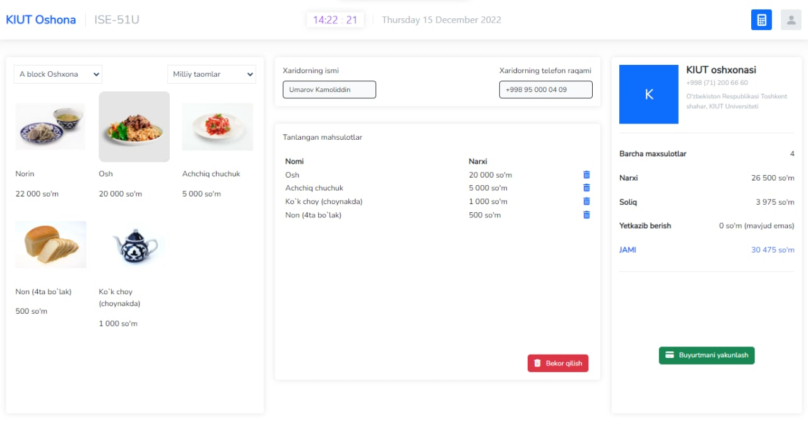

## 🖥 PBL - YTIT Kitchen system

Project for PBL done by ISE-51U group

## 🐙 Github (Source Code)
Github: https://github.com/KIUT-Projects/pbl-kitchen-pos-system

## Admin details:
login: `admin@ytit.uz`

password: `password`

### Group members:
- Umarov Kamoliddin
- Mirxaliqov Kamron
- Mardonov Kamron
- Norboyev Aziz

### Used technologies:
- Laravel v9 Framework (Backend)
- VueJS v3 Framework (Frontend)
- Bootstrap v4 Framework (Frontend CSS)

### Used packages:
- larave-vite
- laravel-mix
- filament (admin panel)

### Installation guide

```shell
git clone https://github.com/KIUT-Projects/pbl-kitchen-pos-system.git
```
```shell
composer install
```
```shell
npm install
```
```shell
php artisan key:generate
```
```shell
php artisan optimize:clear
```
```shell
php artisan migrate
```
```shell
php artisan storage:link
```

### Run in localhost
```shell
php artisan serve
```
```shell
npm run dev
```

## 📂 Download Source Code (v1.2):
Source: https://github.com/KIUT-Projects/pbl-kitchen-pos-system/archive/refs/tags/v1.2.zip

## 🌐 Live Preview:
Live: https://kiut-projects.github.io/pbl-kitchen-pos-system


## 🖼 Screenshorts:



